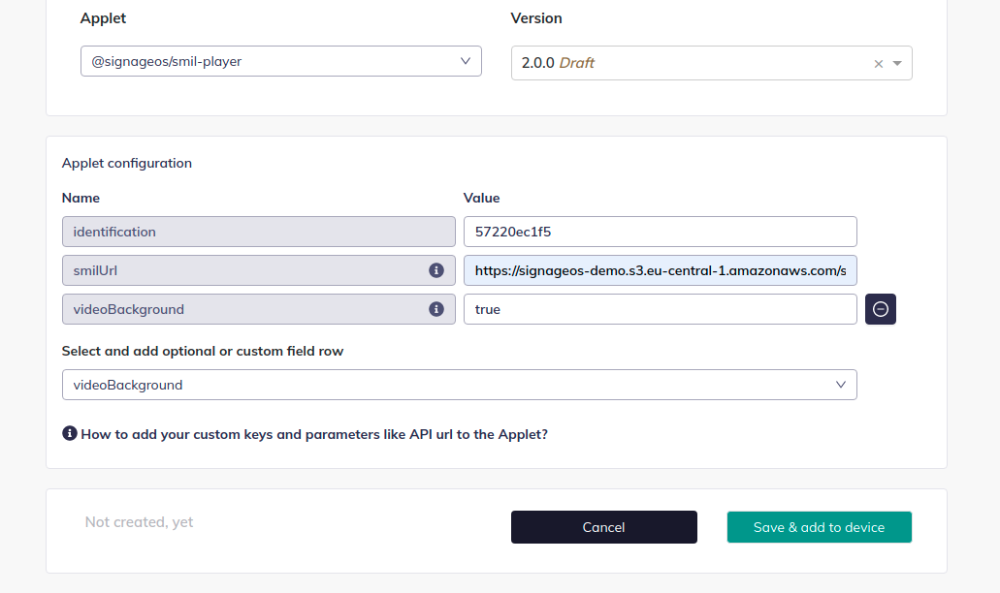

# Video

signageOS SMIL Player supports multimedia objects, including videos, images, streams, video inputs, HTML5 widgets and HTML5 websites.

## Basic usage

A simple video played for its entire duration.

```xml
<video src="ad1.mp4" />
```

To ensure your video will be played, check the [supported video files formats and codecs](https://docs.signageos.io/hc/en-us/articles/4405387474322) by your devices.

## Video duration

If you need to play part of your video, you can define dur attribute. Dur will cut the video playback after defined number of seconds.

``` xml
<video src="ad1.mp4" dur="15s"/>
```

## Videos in Background
Do you need to play a **video in background**? The possibility to play videos in the background is currently under review. As of now, you can workaround the missing layering by forcing all videos to run in the background.

*Known limitations: you cannot layer videos on top of each other.*

## Set videos to play in the background in configuration

You can configure SMIL Player with several parameters including forcing the background video playback.

In the Applet configuration set `videoBackground` to `true`.



Learn more about [Applet configuration here](https://docs.signageos.io/hc/en-us/articles/4405238989458).

## Set videos to play in the background in SMIL Player code

1. Open the `parameters.ts` file
1. Change `background: false` to `background: true` https://github.com/signageos/smil-player/blob/master/config/parameters.ts#L6
1. Build and upload this adjusted version of the SMIL Player
